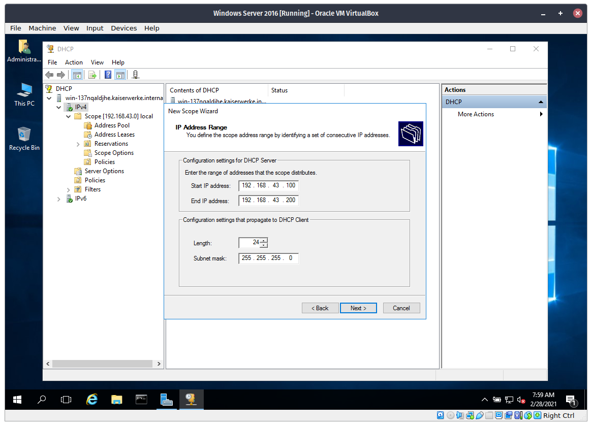

# Configuring DHCP and Connecting Local Devices to the Server

## Procedure


**Step 0**. Connect to a network, a mobile hostpot will suffice.


**Step 1**. Go to the Virtual Machine Settings by click the `Settings` button in the top. Note that the Virtual Machine needs to be powered off to change some settings.


**Step 2**. Go to the Network page and change from `NAT` to `Bridged Adapter` assumming that you didn't change anything from this page. Click `OK`. Then start the VM.


**Step 3**. In the Virtual Machine, go to Command Prompt and take not of the current IP address and Gateway. The Gateway address is the most important here. Also, you'll need to be connected to a network it doesn't matter if there's no internet; your mobile hostpot network will do.


**Step 4**. Enter this information to the static IP addresses. You can change the IP Address of the Server itself but you'll need to enter the correct Gateway address from earlier.

```
If your Gateway address is 192.168.69.1 then your IP address must be 192.168.69.x

You can replace x with numbers from 2-255 assuming that Gateway is 192.168.69.1
```


**Step 5**. Open `DHCP Management Console` from Server Manager.


**Step 6**. Expand `IPv4` then delete the scope you created from other tutorials. Then create a new Scope.



**Step 7**. In the `IP Address Range`, enter an IP Scope, once again, if your gateway is `192.168.69.1` you'll need to enter `192.168.69.100` to `192.168.69.200`.


**Step 8**. Enter the Gateway address here. Then finish the wizard.


**Step 9**. Connect other devices through the same network as the Server. 


**Step 10**. If the IP Address of the device is in range on the scope of the IP Address you entered earlier, the device will see that it has been connected to the server. And the server will see the devices in the network.