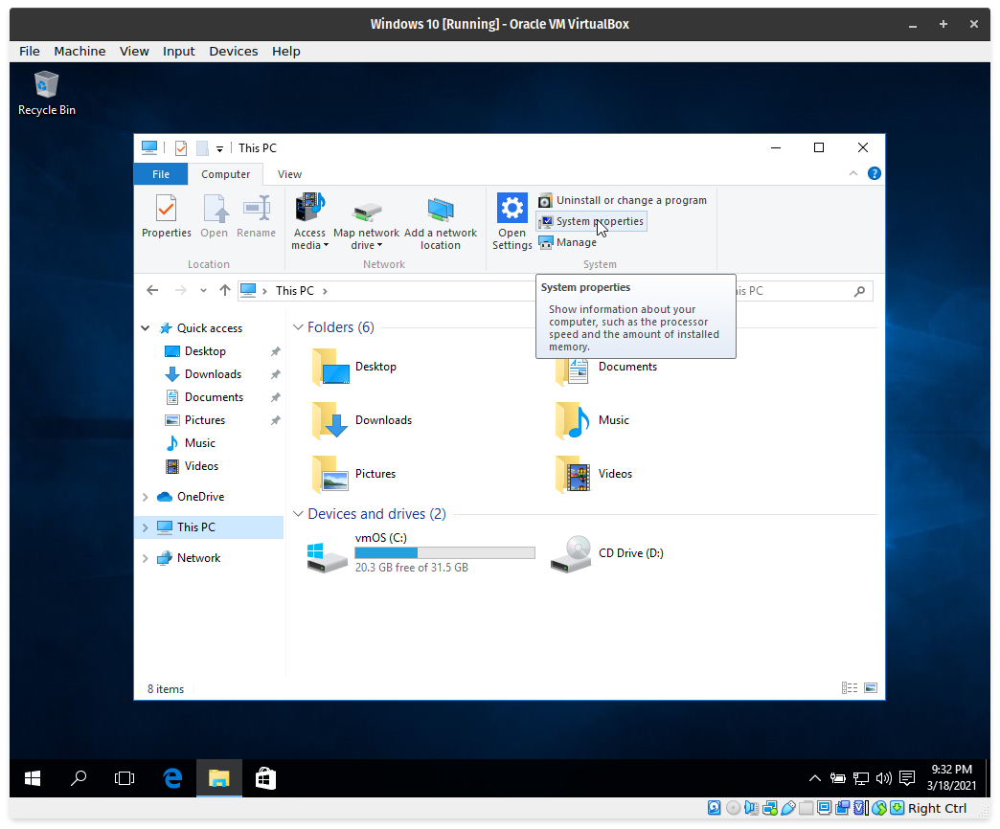
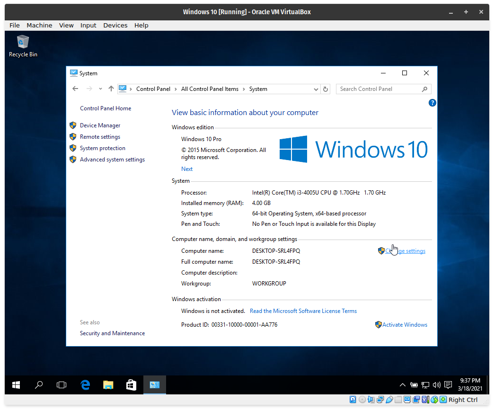
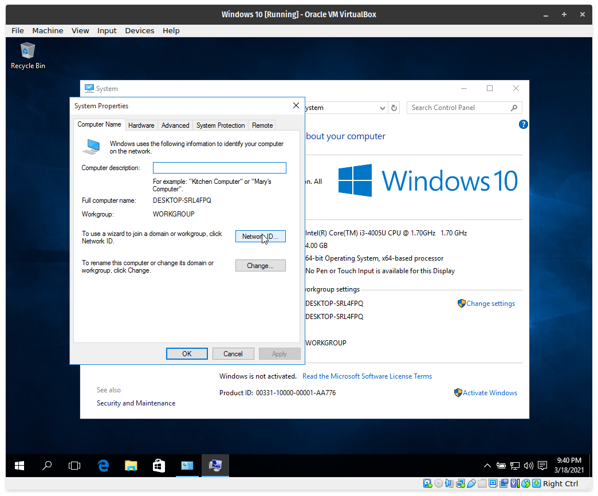
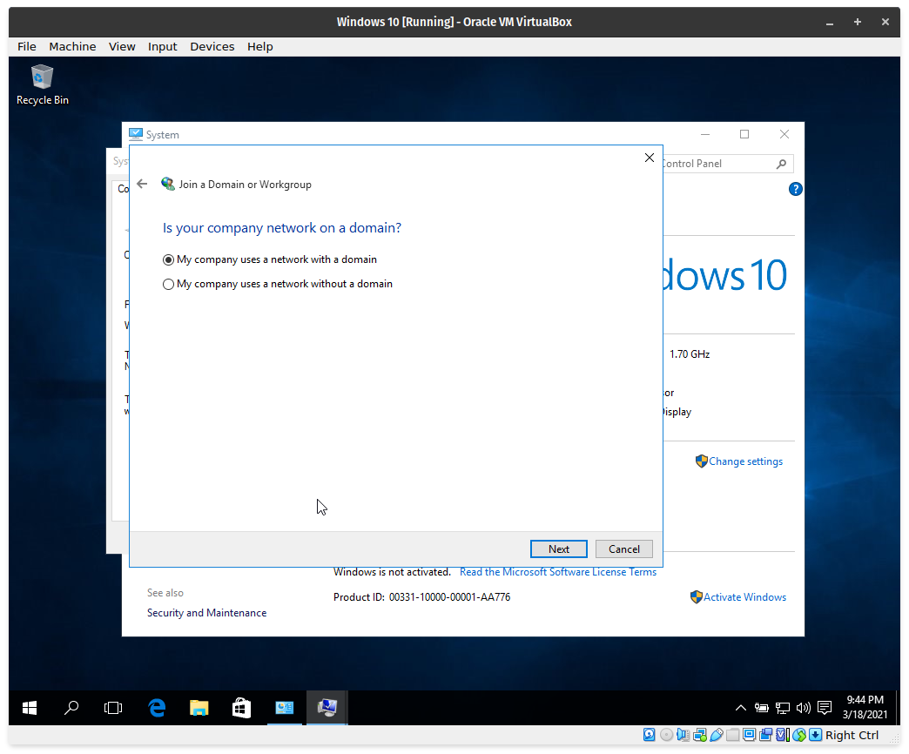
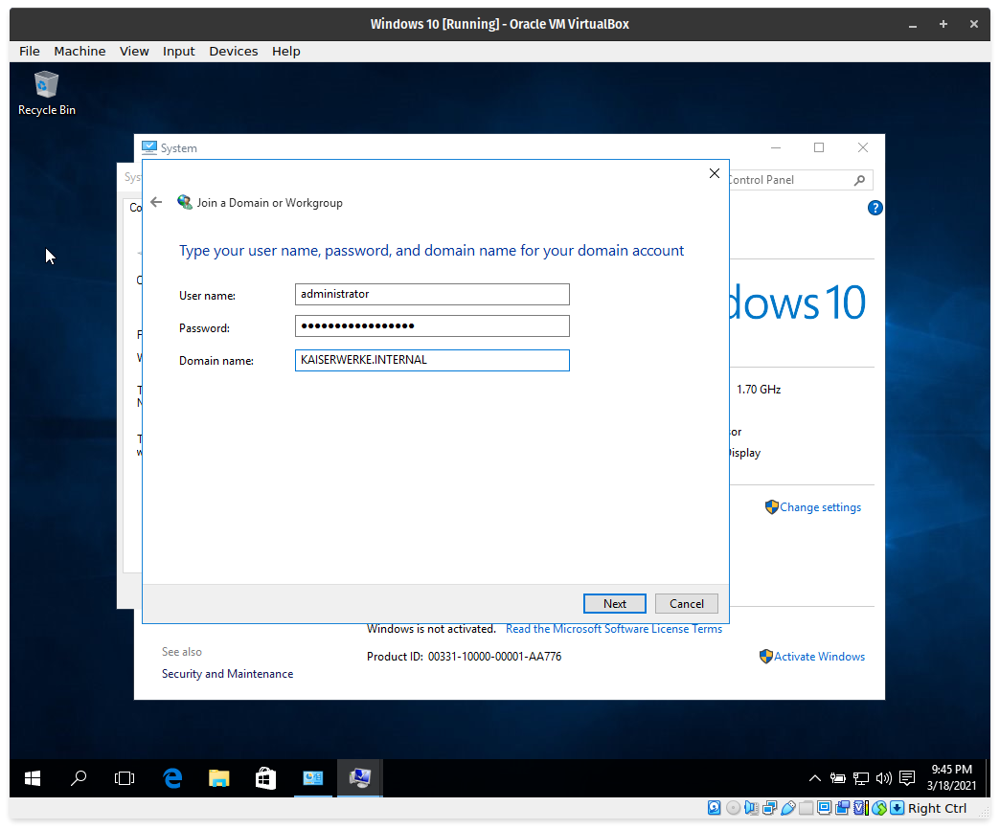
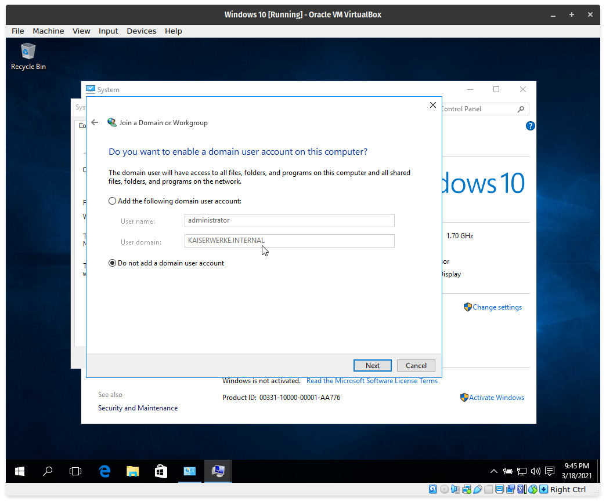
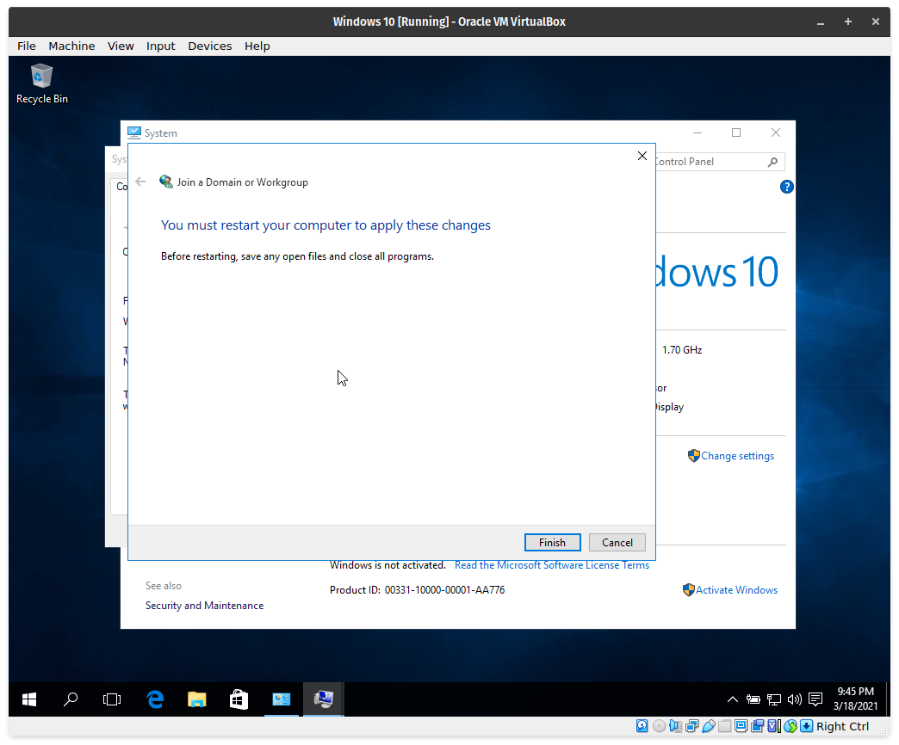

# Connecting the Client Machine to the Domain Network

## Phase 1

**Step 1**. Remember what domain you have entered earlier. Mine is `KAISERWERKE.internal`, but some of you maybe inputted domain names ending with `.local` or `.com` or even `.org`.

## Phase 2 

**Step 1**. Open `This PC` then show the items in the ribbon menu. Click `System Properties`.

**Step 2**. In `System Properties`, click `Change Settings` in the lower right side.

**Step 3**. A new dialog will open, click the `Network ID` button.

**Step 4**. Select the option that says, `This computer is part of a business network; I use it to connect to other computers at work`; then click `Next`.

**Step 5**. Select the option with says, `My company uses a network with a domain.`, then click `Next` again.

**Step 6**. Enter the credentials for the server on the client. `administrator` will likely be the username as it is the default. Enter also the domain name.

**Step 7**. If prompted, do not add the account.

**Step 8**. If all information are correct, you will be prompted to restart the virtual machine.