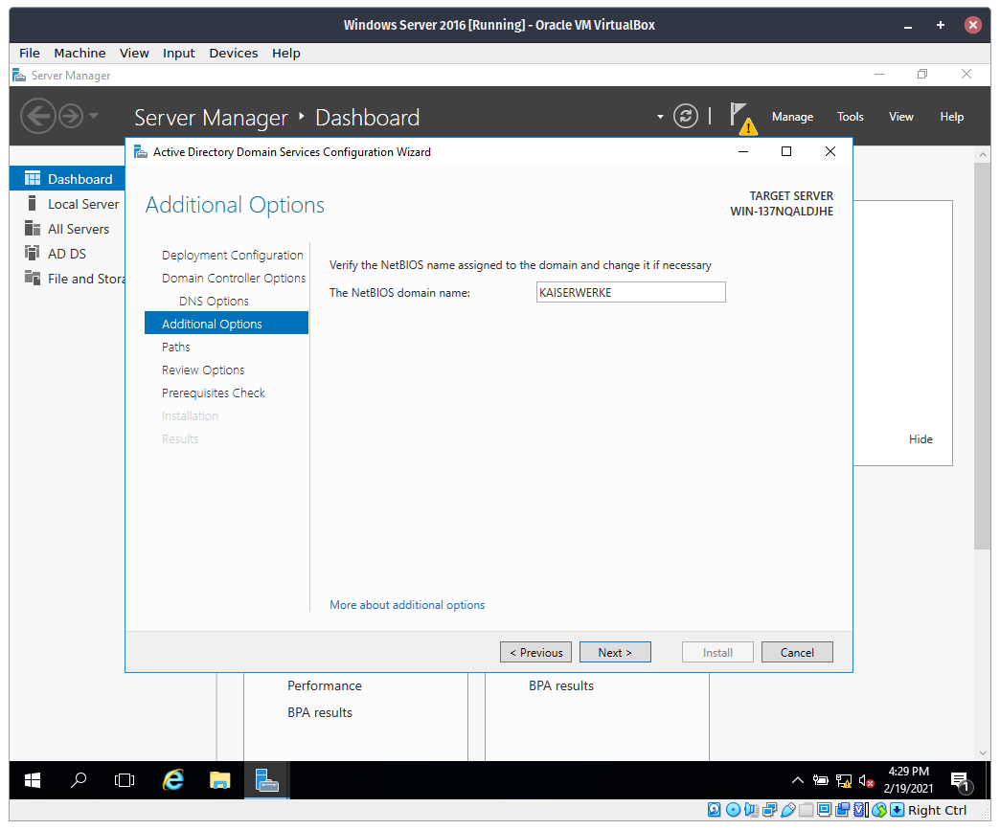
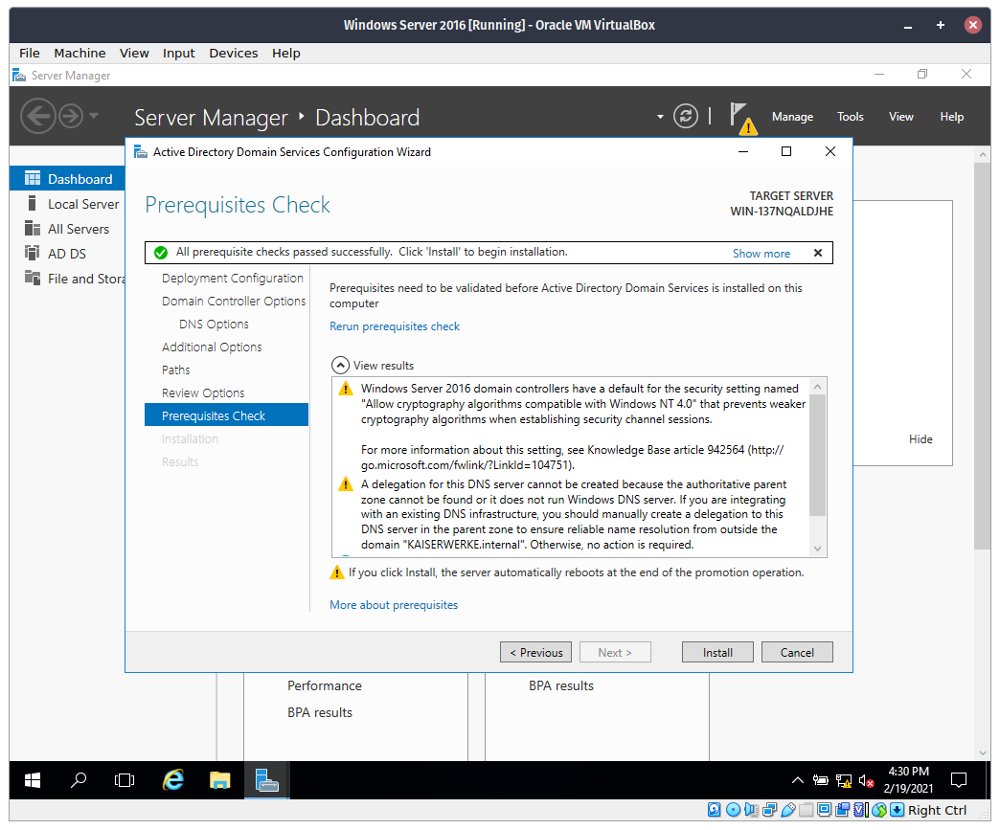

# Enable and Configure Active Directory Services

## Procedure

### *This guide assumes that you have already setup a static IP on the server. If you didn't, follow [this](static-ip.md) guide.*

**Step 1**. Open the Start Menu then open `Server Manager`.

**Step 2**. In Server Manager, click `Add roles and features`.

**Step 3**. Click `Next`

**Step 4**. Leave everything as is, then click `Next` again.

**Step 5**. In the `Server Pool list`, click the only option below, then click `Next`.

**Step 6**. Check `Active Directory Domain Services`

**Step 7**. Once again, click `Add Features`

**Step 8**. Check `DNS Server`.

**Step 9**. Leave everything as is, then click `Next`.

**Step 10**. Wait for it to install. Then click `Close`.

**Step 11**. Click the yellow warning icon in the top, then click `Promote this server to a domain controller`

**Step 12**. Select `Add a new forest` then type a domain name. Then click `Next`

**Step 13**. Leave everything as is, then type a password.

**Step 14**. Click `Next`.

**Step 15**. Specify a NetBIOS name or leave the default, then click next.

**Step 16**. Click next.

**Step 17**. Click next again.

**Step 18**. Wait for it to install.

**Step 19**. From within Server Manager, click `Tools` then `Active Directory Users and Computers`.

**Step 20**. Expand the domain root (mine is `KASERWERKE.internal`) then click `Domain Controllers`. You should see your server being displayed. Close the window.

**Step 21**. Go back to Server Manager then click `Local Server` at the left side then click `Remote Desktop`.

**Step 22**. Select `Allow remote connections to this computer`. Then uncheck the option `Allow connections only from computers running Remote Desktop with Network Level Authentication`.