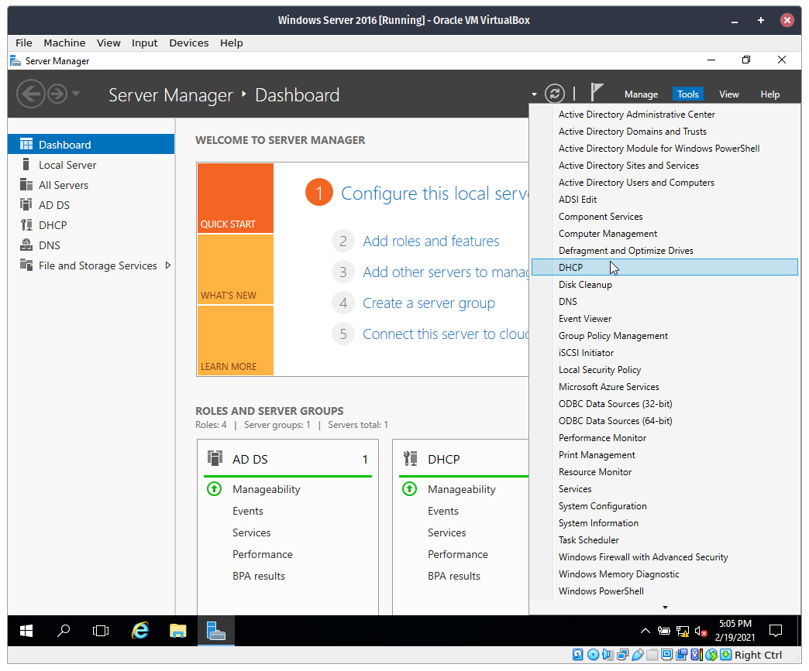
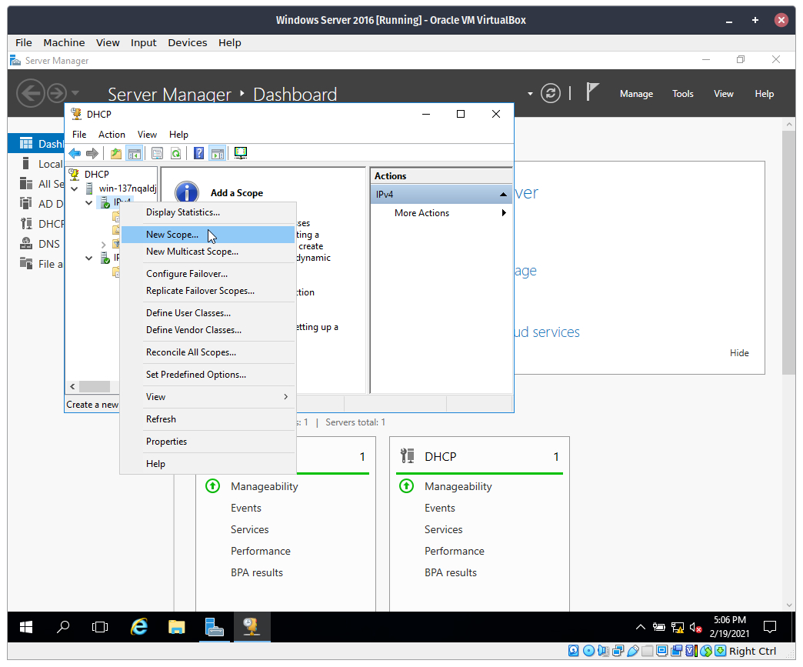
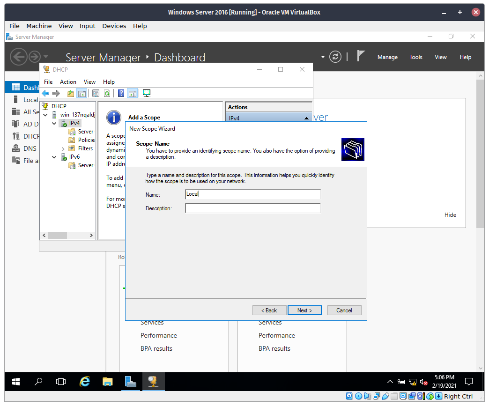
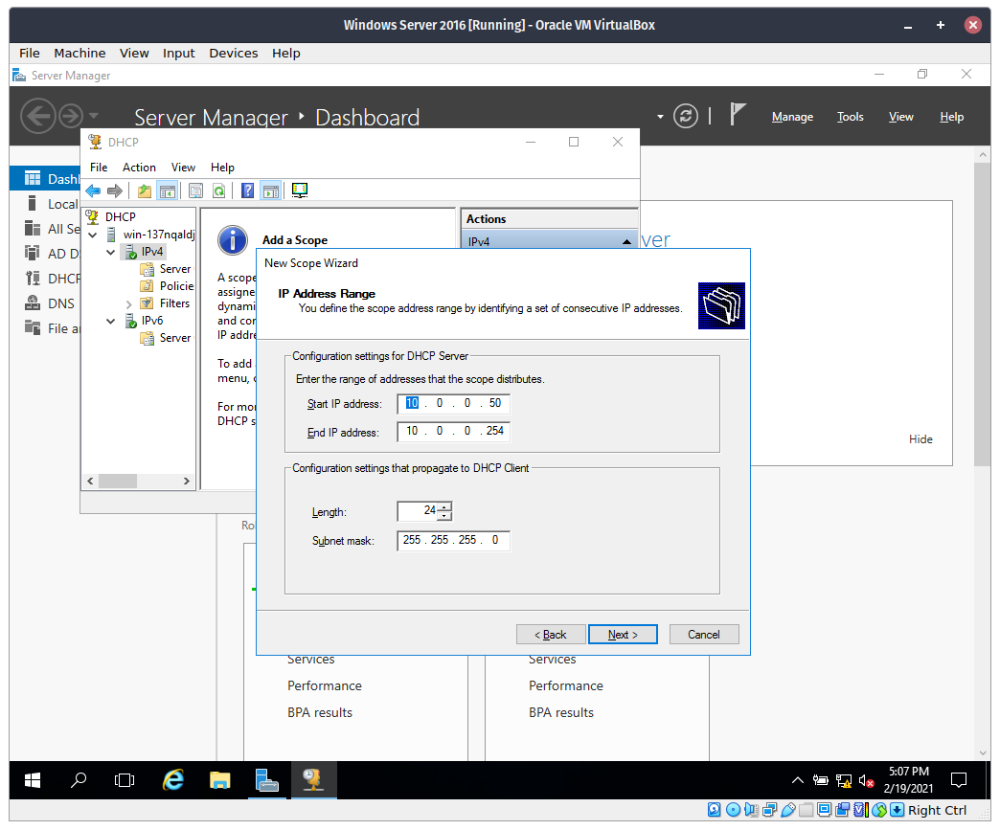
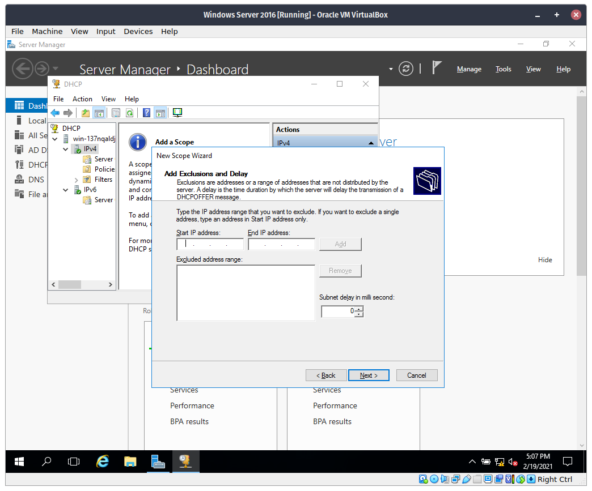
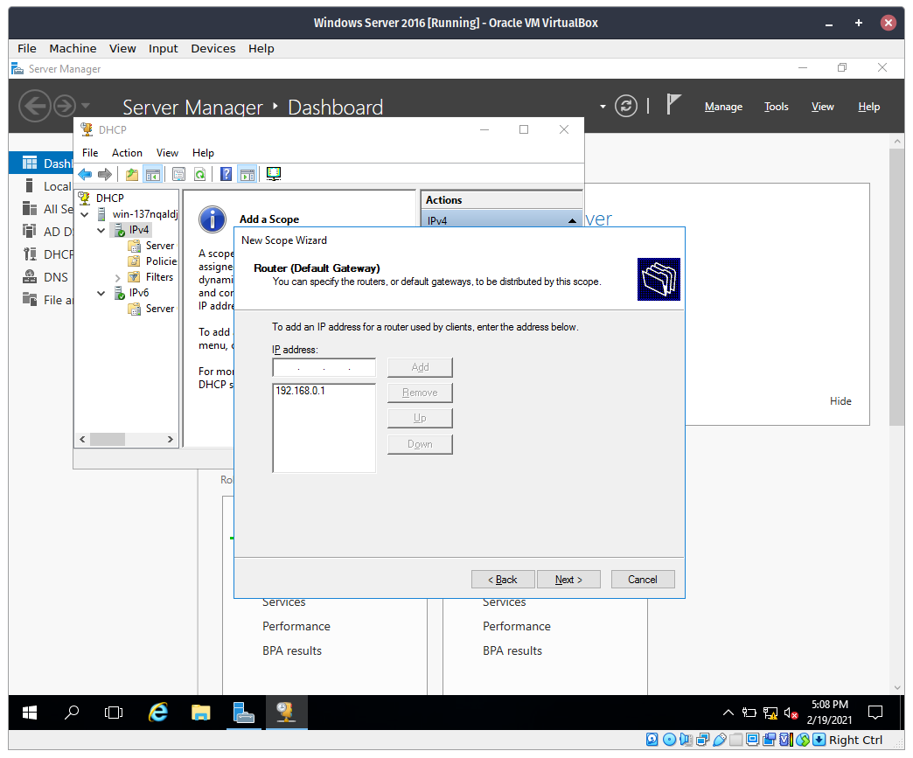
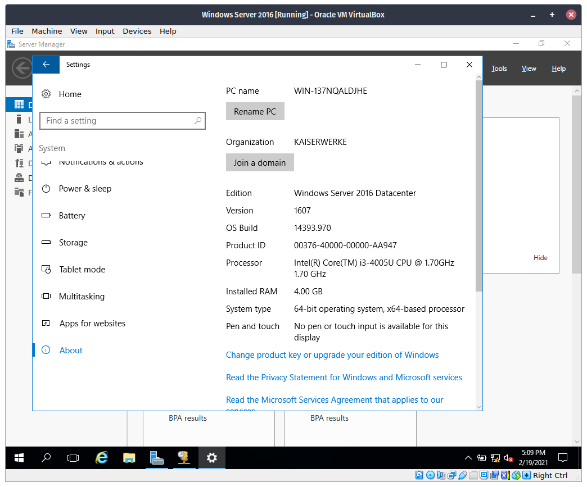
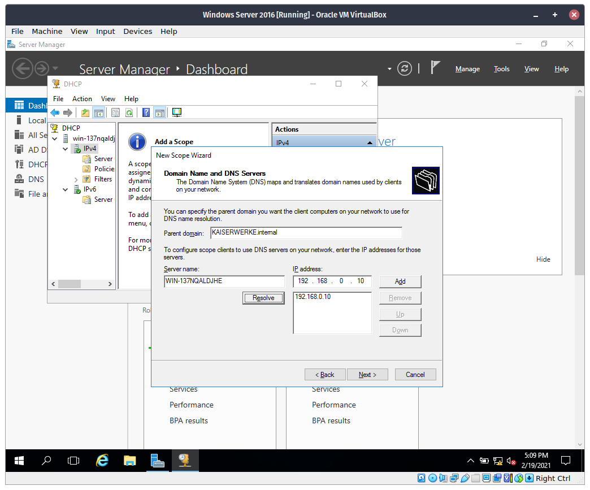
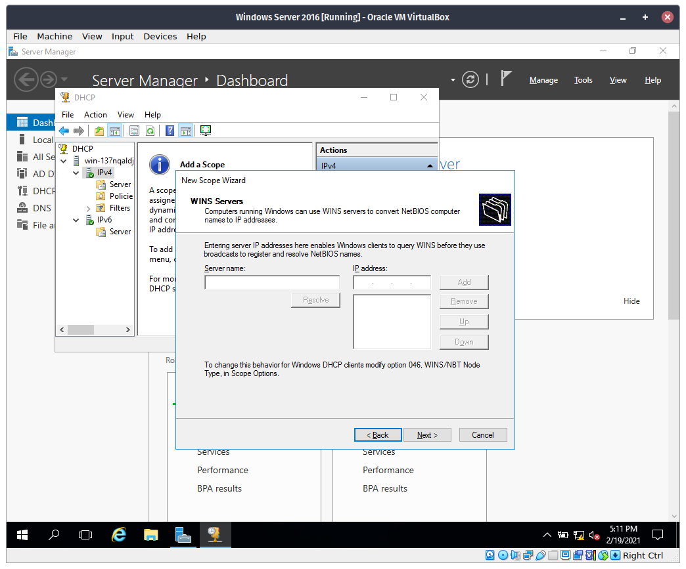
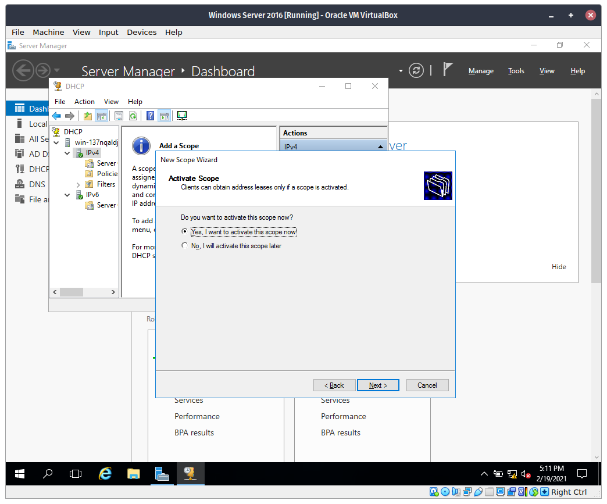

# Enable DHCP Server in Windows Server 2016

## Procedure

```
This guide assumes that you have already setup a static IP on the server. If you didn't, follow [this](static-ip.md) guide.
```

### **Adding through the Server Manager**


**Step 1**. Open the Start Menu then open `Server Manager`.


**Step 2**. In Server Manager, click `Add roles and features`.


**Step 3**. Click `Next`


**Step 4**. Leave everything as is, then click `Next` again.


**Step 5**. In the `Server Pool list`, click the only option below, then click `Next`.


**Step 6**. Check the `DHCP Server` option. Then click `Next.


**Step 7**. Click next.


**Step 8**. Click next.


**Step 9**. Wait for it to install.


**Step 10**. After installing click the yellow warning icon at the top then click `Configure DHCP Configuration`.


**Step 11**. Click next.


**Step 12**. Click `Commit`.


**Step 13**. Click `Close`.

### **Configuration**



**Step 14**. Click `Tools` in the upper part of the interface then click `DHCP`.



**Step 15**. Expand the server then right click `IPv4`, then click `New Scope` in the context menu.



**Step 16**. Type in a name for the scope.



**Step 17**. Enter the range of addresses that the scope distributes. Then type the length then click `Next`.



**Step 18**. If there are any excluded address, add them here. If you are done, click `Next`.


**Step 19**. Click next.



**Step 20**. Enter the IP Address of the router.




**Step 21**. Enter the domain name and its address.
```
Hint: The domain name is the PC name in the About section in the Settings app.
```


**Step 22**. Click next.



**Step 23**. Leave the current selection then click next.