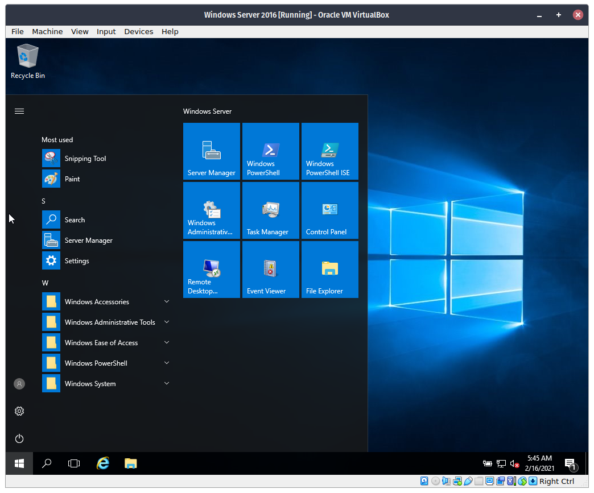

# Enable DHCP Server in Windows Server 2016

## Procedure

This guide assumes that you have already setup a static IP on the server. If you didn't, follow [this](static-ip.md) guide.

### **Adding through the Server Manager**

**Step 1**. Open the Start Menu then open `Server Manager`.

**Step 2**. In Server Manager, click `Add roles and features`.

**Step 3**. Click `Next`

**Step 4**. Leave everything as is, then click `Next` again.

**Step 5**. In the `Server Pool list`, click the only option below, then click `Next`.

**Step 6**. Check the `DHCP Server` option. Then click `Next.

**Step 7**. Click next.

**Step 8**. Click next.

**Step 9**. Wait for it to install.

**Step 10**. After installing click the yellow warning icon at the top then click `Configure DHCP Configuration`.

**Step 11**. Click next.

**Step 12**. Click `Commit`.

**Step 13**. Click `Close`.