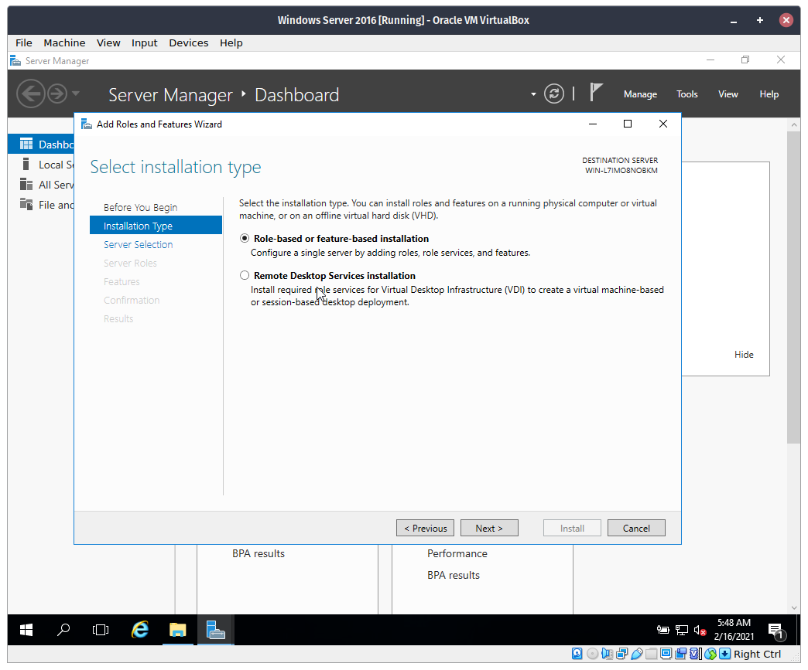
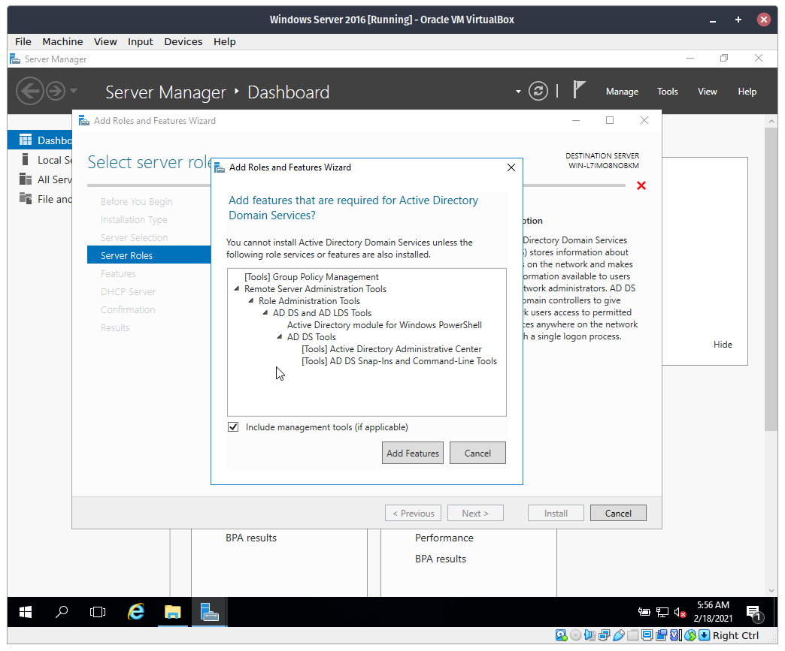
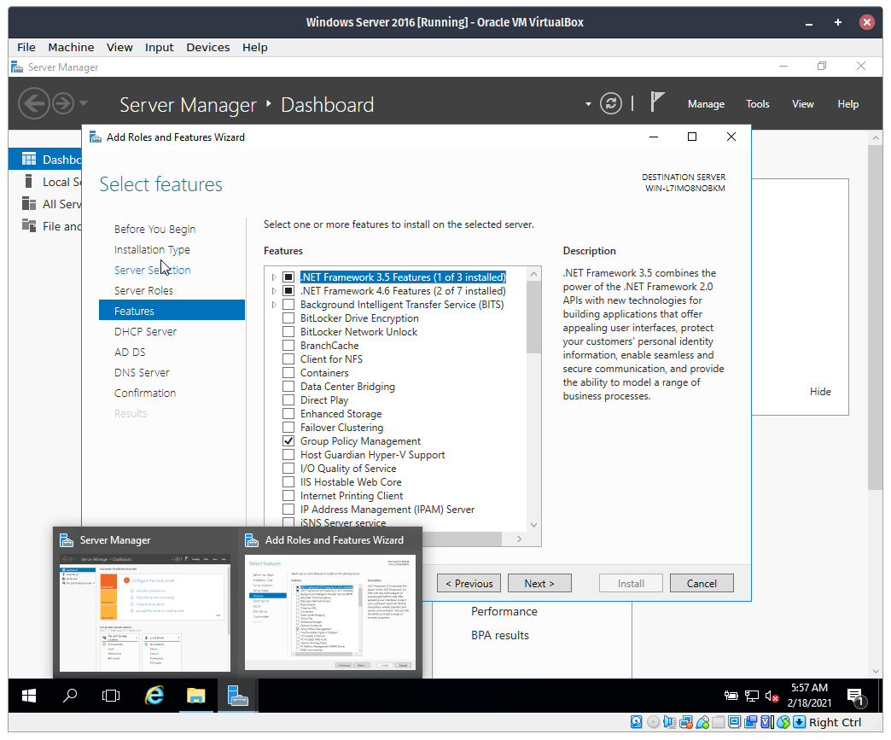
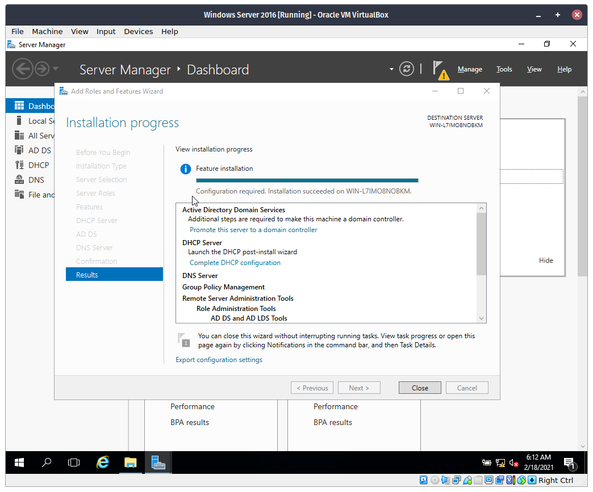

# Enabling Active Directory, DNS Server and DHCP Server

## Procedure

**Step 1**. Open the Start Menu then open `Server Manager`.

**Step 2**. In Server Manager, click `Add roles and features`.

**Step 3**. Click `Next`

**Step 4**. Leave everything as is, then click `Next` again.

**Step 5**. In the `Server Pool list`, click the only option below, then click `Next`.

**Step 6**. Check `DCHP Server`.

**Step 7**. In the new popup, click `Add Features`

**Step 8**. Check `Active Directory Domain Services`

**Step 9**. Once again, click `Add Features`

**Step 10**. Check `DNS Server`.

**Step 11**. Leave everything as is, then click `Next`.

**Step 12**. Wait for it to install. Then type `Close`.