# Installing Windows Server 2016 on VirtualBox

## Prerequisites
* [VirtualBox](https://download.virtualbox.org/virtualbox/6.1.18/VirtualBox-6.1.18-142142-Win.exe)
* Windows Server 2016 ISO

## Procedure

*This tutorial assumes you have already downloaded and installed the required materials.*

### Phase 1: Creating a Virtual Machine

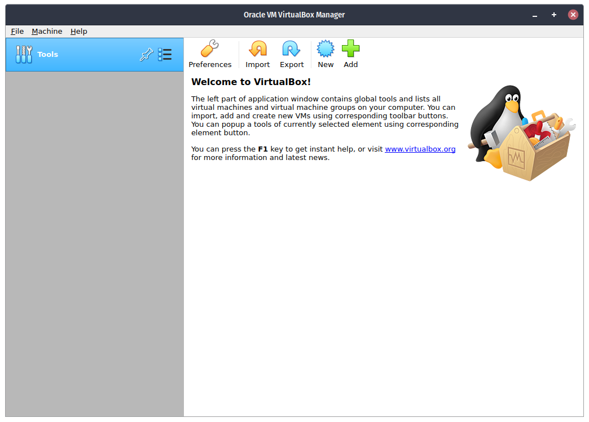

**Step 1**. Open up VirtualBox then click the `New` button on the upper part of the interface.

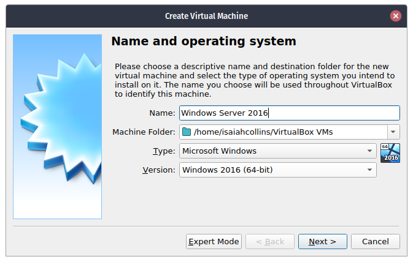

**Step 2**. Then type the name of your Virtual Machine, although not required, you can use the name operating system that will be installed on the VM.

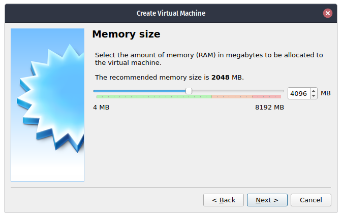

**Step 3**. Specify how much RAM that will be allocated to the Virtual Machine. It is recommended that you do not put more than half of your host machine's memory.

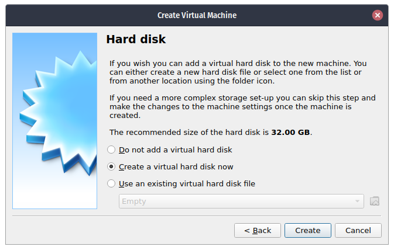

**Step 4**. Click Create.

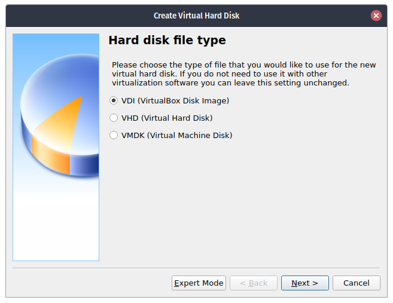

**Step 5**. Click Next.

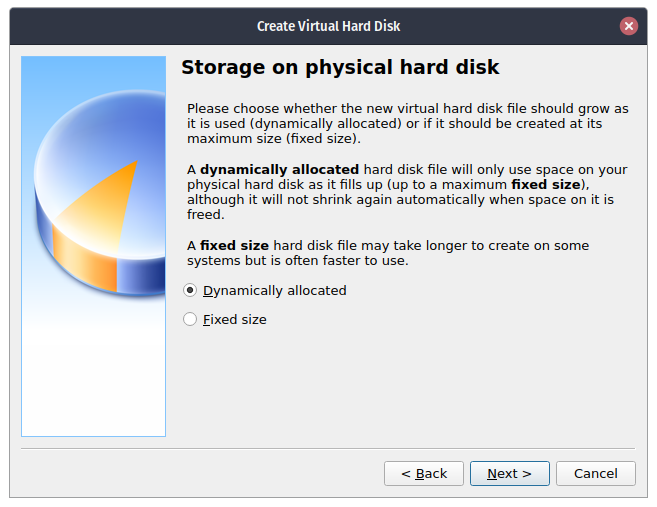

**Step 6**. Choose `Dynamically Allocated` then click `Next`.

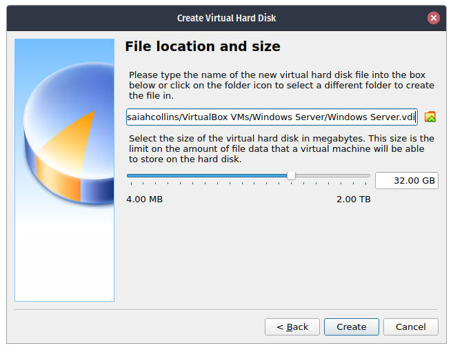

**Step 7**. Specify the size of the virtual disk. The minimum recommended is 32GB but you can adjust it how much as your storage allows it.

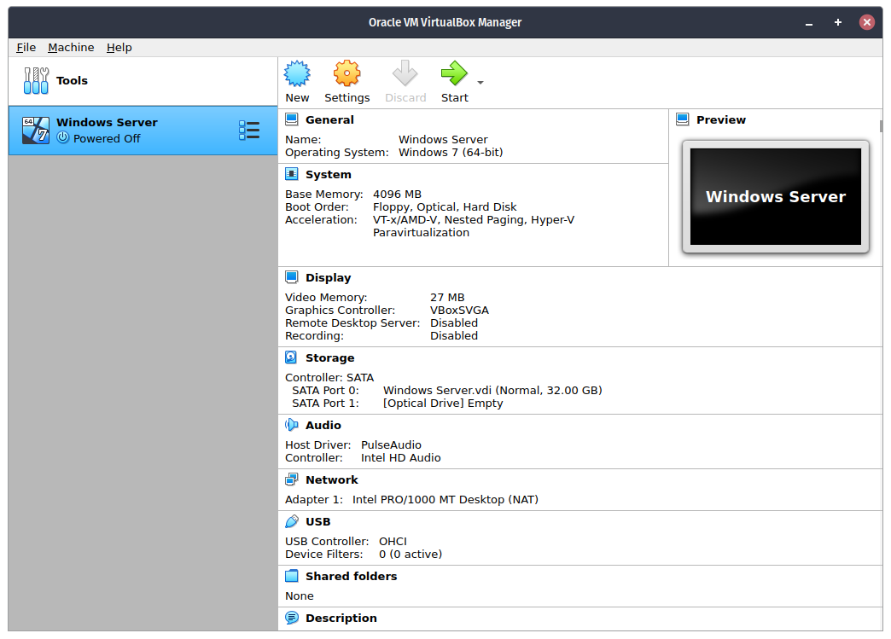

**Step 8**. You are done. The Virtual Machine is created.

### Phase 2 - Installation

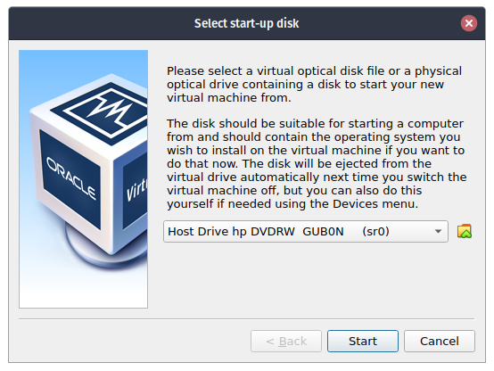

**Step 1**. Start the Virtual Machine by click the `Start` button at the upper portion of the user interface. Click the little folder icon at the right side of the dialog at will eventually show up.

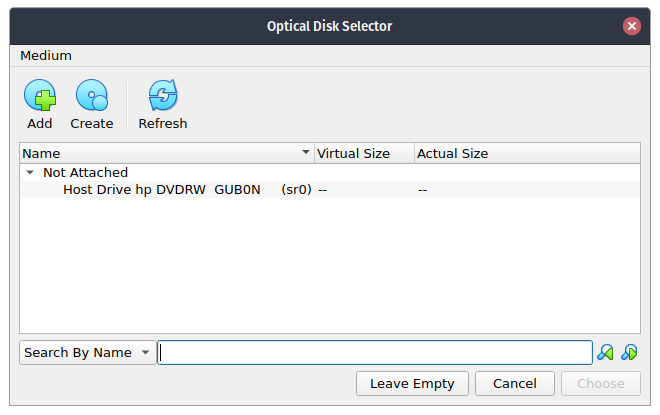

**Step 2**. A new dialog will show up. Click the `Add` button at the top.

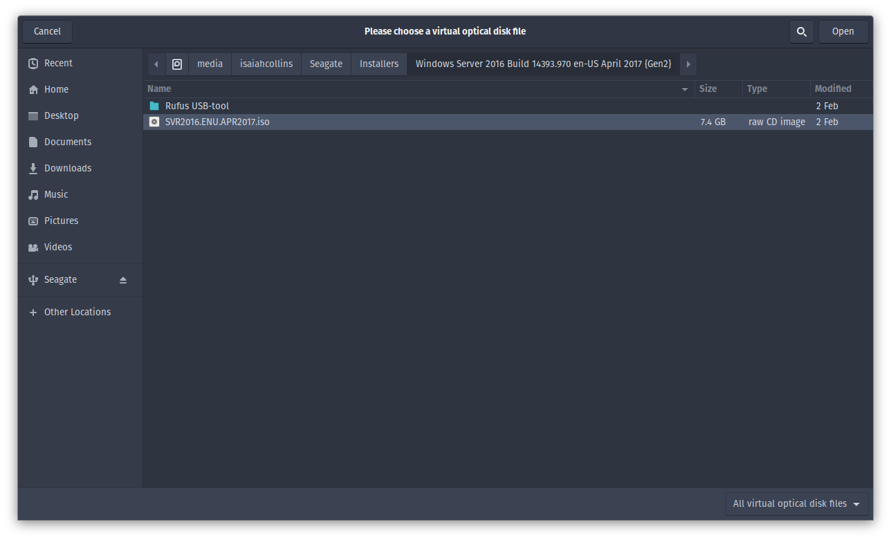

**Step 3**. Browse for the ISO file you downloaded earlier.
```
The file with the name:
Windows_Server_2016_Datacenter_EVAL... .iso
```

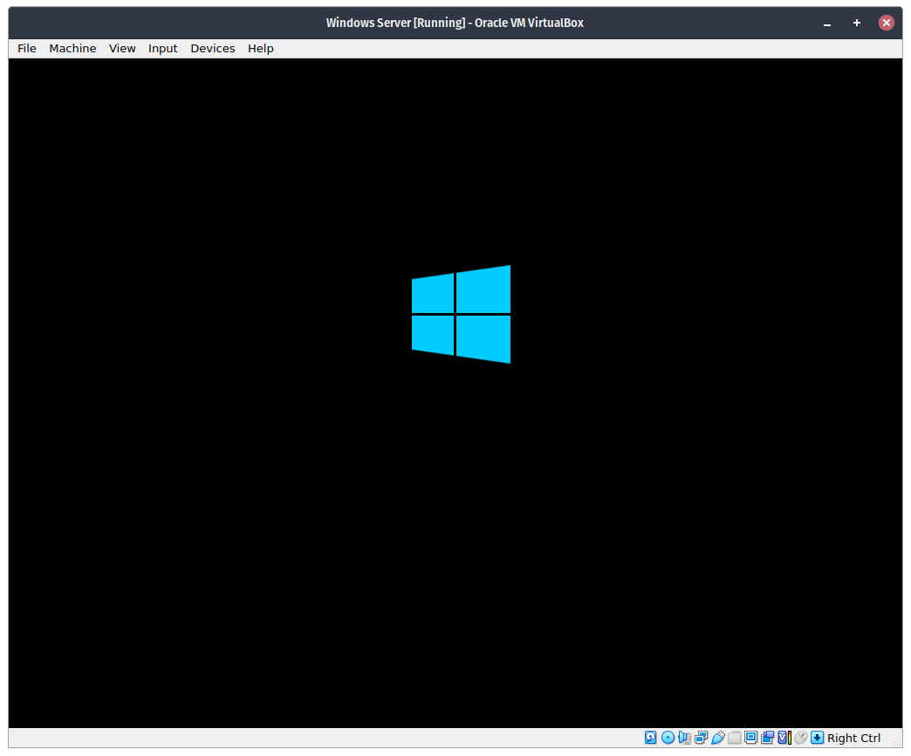

**Step 4**. Click choose, then `Start` the Virtual Machine. You will be presented with the image above.

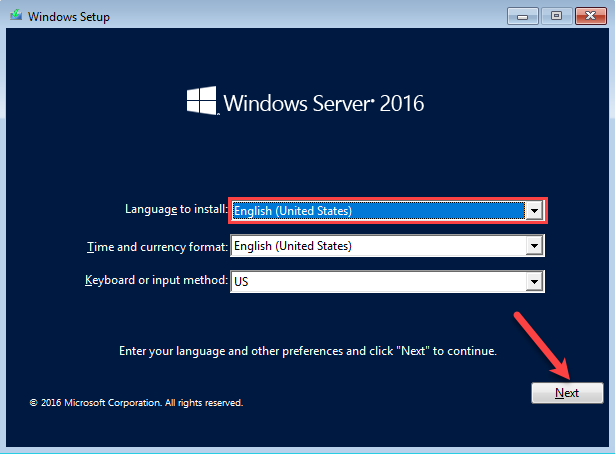

**Step 5**. Eventually the installer will ask your language and keyboard preferences, leave everything as is then click `Next`.

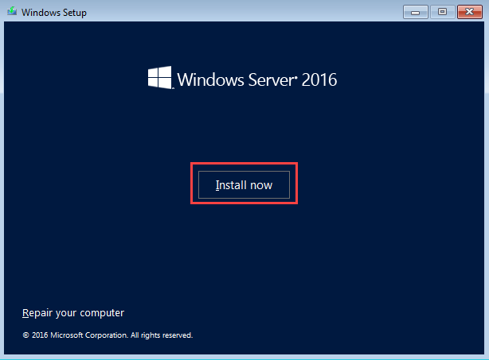

**Step 6**. Click `Install Now`

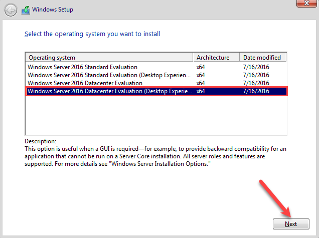

**Step 7**. Select `Windows Server 2016 Datacenter Evaluation (Desktop Experience)`. 

```diff
- If you do not select the correct edition, the one with the `Desktop Experience` you will have no GUI to work on!
```

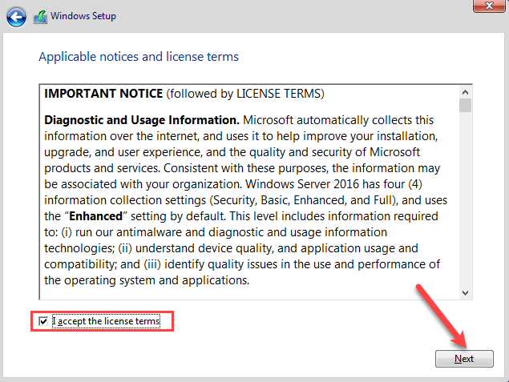

**Step 8**. Read and accept the license terms.

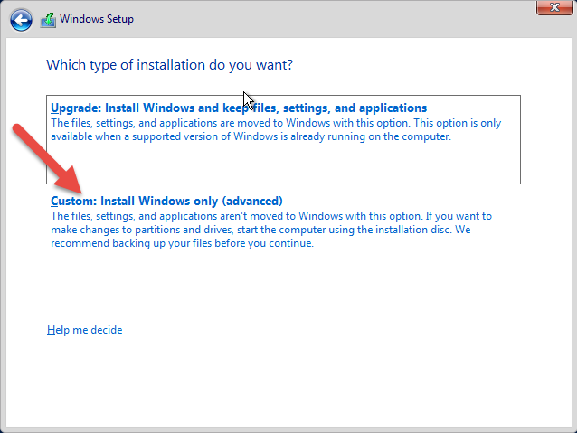

**Step 9**. Select `Custom` as the Virtual Machine does not have any operating systems installed on it yet.

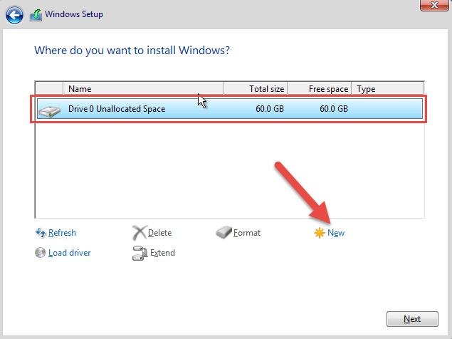

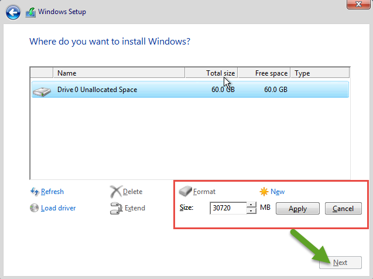

**Step 10**. Click `New` to create a new partition. A warning appears which wants you to give the permission to system to create a drive for system files. Click on `Ok` button, if you want to add more drives do this process again. When finished hit Next.

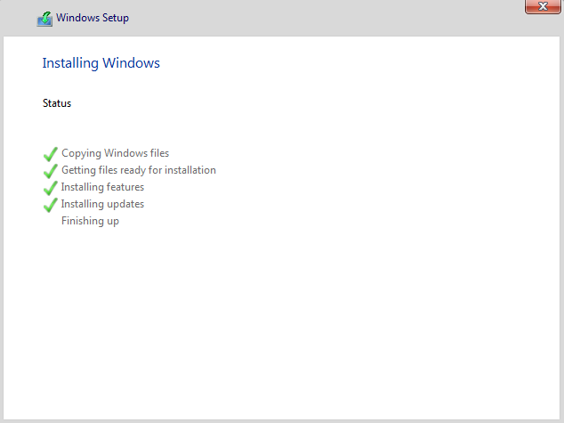

**Step 11**. After clicking `Next`. Wait for the installation to finish. The virtual machine will restart itself a couple of times so be patient. ~~Especially users without SSDs~~.

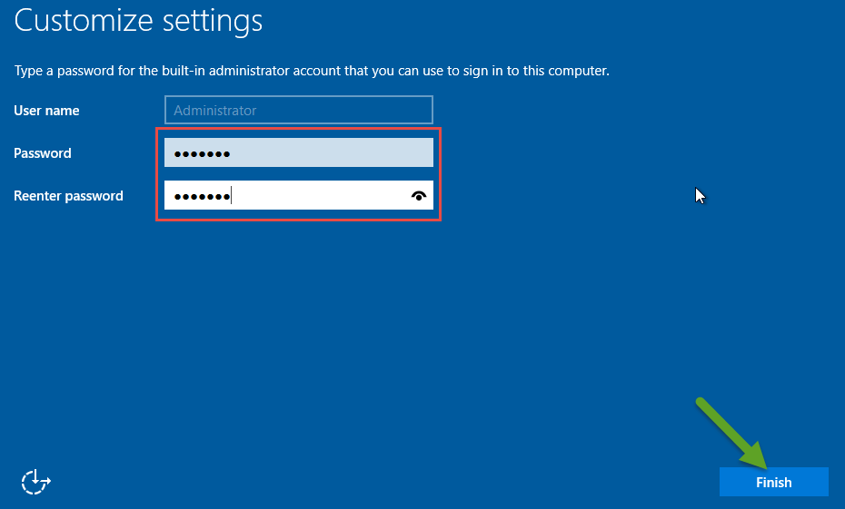

**Step 12**. After a couple of restarts, the installer will ask for an Administrative Password, enter it two times then click `Finish`.

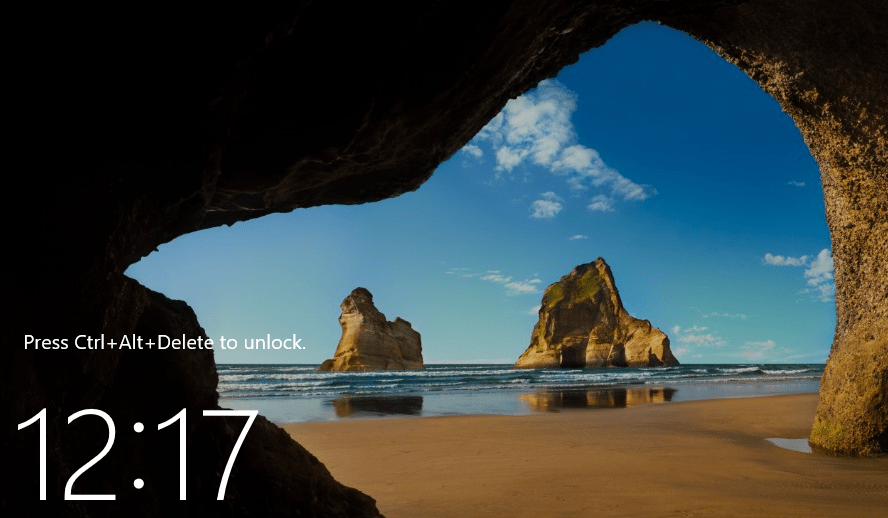

**Step 13**. Press `CTRL + ALT + DEL` to login to the Virtual Machine, if Windows intercepts it, go to the Virtual Machine -> `Input` -> `Keyboard` -> `Insert CTRL + ALT + DEL`