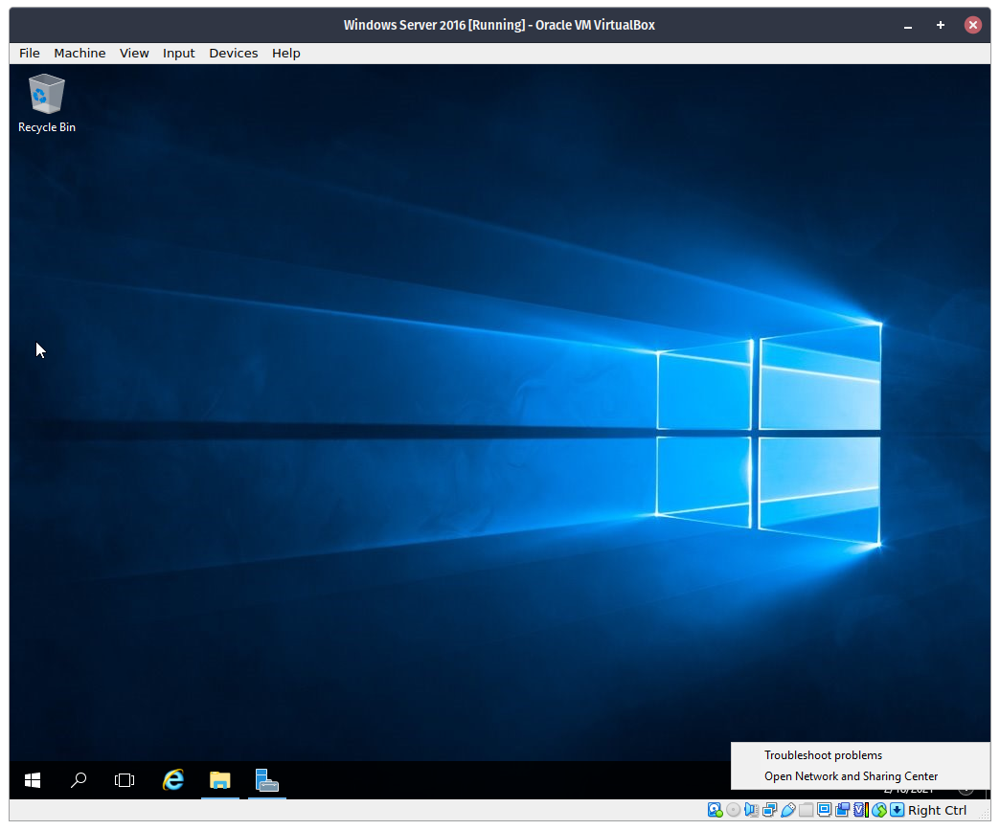
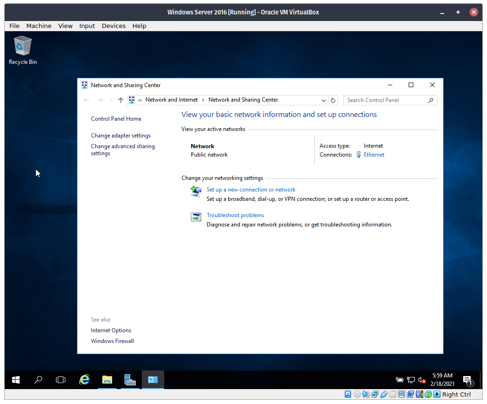
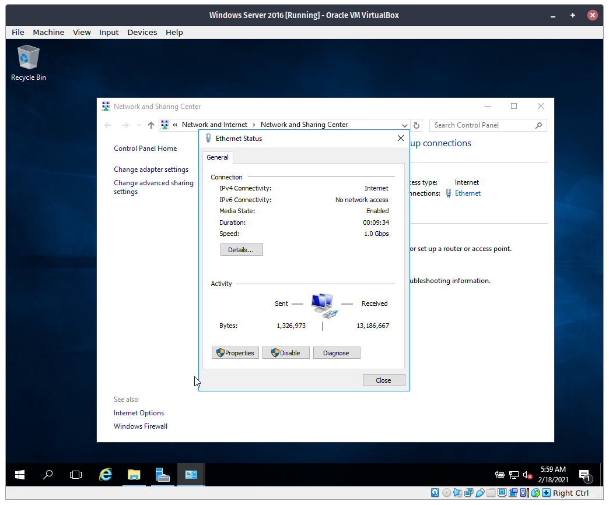
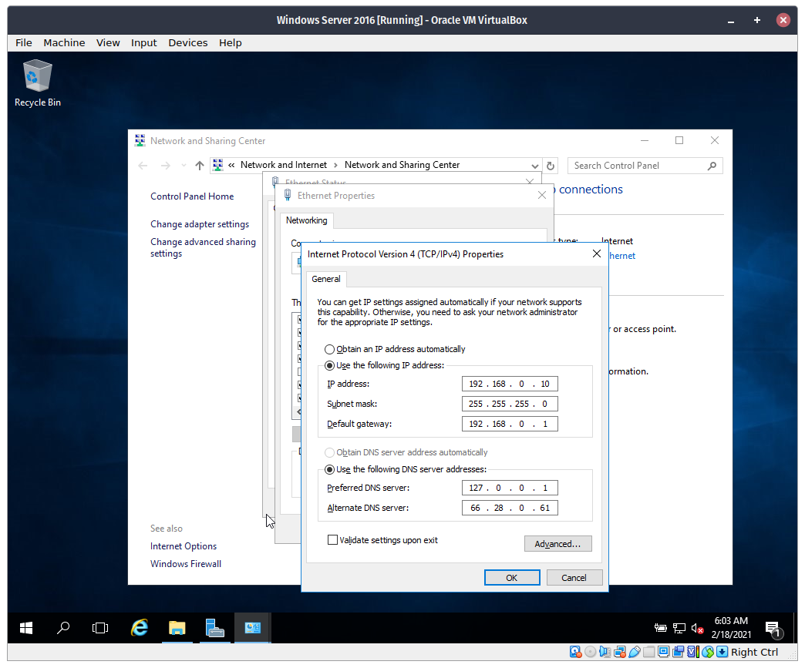

# Setting-up a Static IP Address in Windows Server

## Procedure

**Step 1**. On the taskbar, right-click on the network indicator on the system tray. Then select, `Open Network and Sharing Center`.

**Step 2**. Network and Sharing Center will be appear. Click `Ethernet`.

**Step 3**. On the new dialog, click the `Properties` button.

**Step 4**. Another dialog will appear, double-click `Internet Protocol Version 4 (TCP/IPv4)` from the list.

**Step 5**. A new dialog will open. Select `Use the following IP address` then enter the required values. Then click `OK`. Proceed to close all dialogs.